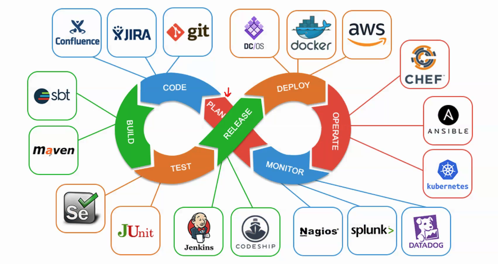
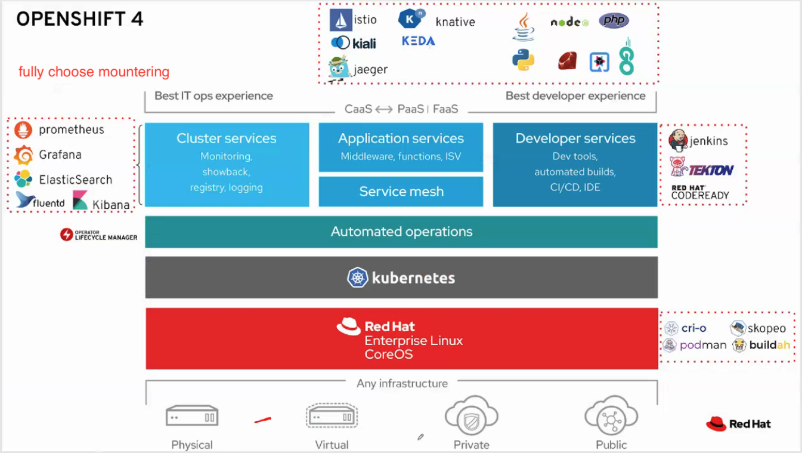
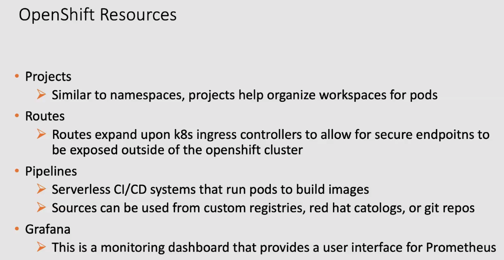

## OpenShift
OpenShift is a family of containerization software developed by Red Hat. Its flagship product is the OpenShift Container Platform—an on-premises platform as a service built around Docker containers orchestrated and managed by Kubernetes on a foundation of Red Hat Enterprise Linux.

    Normal CI/CD tools:

## Kubernetes vs Openshift
open source project vs Red Hat offering

